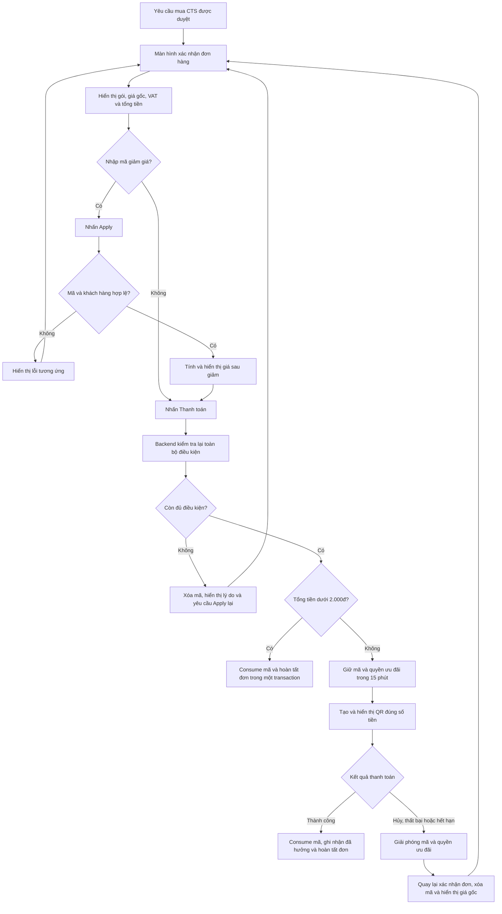

# Đặc tả tính năng áp dụng mã giảm giá cho đơn hàng Chữ ký số

## 1. Mục tiêu

Thêm bước **Xác nhận đơn hàng** sau khi yêu cầu mua Chữ ký số (CTS) được duyệt và trước bước thanh toán.

Tại bước này, khách hàng có thể:

- Xem thông tin CTS và gói đã đăng ký.
- Xem giá gốc, tiền giảm, VAT và tổng tiền phải thanh toán.
- Nhập và kiểm tra mã giảm giá.
- Chọn có xuất hóa đơn hay không và nhập thông tin hóa đơn nếu cần.
- Chuyển sang thanh toán QR hoặc hoàn tất đơn không cần QR tùy tổng tiền cuối cùng.

Hệ thống phải bảo đảm:

- Mã chỉ áp dụng cho đúng loại CTS và đúng gói được cấu hình.
- Không sử dụng vượt quá số lượt của mã.
- Một khách hàng chỉ được hưởng ưu đãi một lần trên mỗi gói CTS.
- Việc kiểm tra, giữ và sử dụng mã an toàn khi nhiều khách hàng thao tác đồng thời.
- Mã được giữ trong thời gian chờ thanh toán và tự động được giải phóng nếu thanh toán không hoàn tất.

---

## 2. Thuật ngữ

| Thuật ngữ | Ý nghĩa |
|---|---|
| Loại CTS | Nhà cung cấp hoặc loại Chữ ký số, ví dụ CMC, Intrust |
| Gói CTS | Gói sản phẩm cụ thể của một loại CTS, ví dụ CMC 3 tháng hoặc Intrust 12 tháng |
| Apply mã | Kiểm tra tính hợp lệ và tính lại giá tạm thời; chưa giữ lượt mã |
| Reservation | Bản ghi giữ một lượt mã và quyền hưởng ưu đãi trong thời gian thanh toán |
| Consume | Ghi nhận lượt mã đã được sử dụng chính thức |
| Release | Giải phóng lượt đang giữ để người khác có thể sử dụng |
| Khách hàng | Chủ thể đã được định danh dùng để kiểm tra giới hạn hưởng ưu đãi |

---

## 3. Ví dụ cấu hình nghiệp vụ

| Loại CTS | Gói | Giá gốc | Mã | Mức giảm | Tổng lượt |
|---|---:|---:|---|---:|---:|
| CMC | 3 tháng | 100.000đ | J2TEAM01 | 100% | 1 |
| CMC | 3 tháng | 100.000đ | J2TEAM02 | 100% | 1 |
| CMC | 3 tháng | 100.000đ | NEWBIE | 100% | Theo cấu hình |
| CMC | 6 tháng | Theo cấu hình | Không áp dụng | — | — |
| CMC | 12 tháng | Theo cấu hình | Không áp dụng | — | — |
| Intrust | 12 tháng | 800.000đ | CASSO | 90% | Theo cấu hình |
| Intrust | 12 tháng | 800.000đ | CASSO1 | 99% | Theo cấu hình |
| Intrust | 12 tháng | 800.000đ | CASSO2 | 100% | Theo cấu hình |
| Intrust | 24 tháng | Theo cấu hình | Không áp dụng | — | — |
| Intrust | 36 tháng | Theo cấu hình | Không áp dụng | — | — |

Không được suy luận phạm vi áp dụng dựa trên tên mã. Quan hệ giữa mã và gói phải được cấu hình rõ trong dữ liệu.

---

## 4. Quy tắc nghiệp vụ

### BR-01: Mã áp dụng theo gói CTS

Mã giảm giá chỉ hợp lệ khi được cấu hình cho đúng `product_package_id` của đơn hàng.

Một `product_package_id` phải định danh duy nhất tổ hợp:

```text
Loại CTS + gói/thời hạn + phiên bản sản phẩm (nếu có)
```

Mã của CMC 3 tháng không được dùng cho CMC 6 tháng hoặc Intrust 12 tháng.

### BR-02: Giới hạn lượt của mã

Mỗi mã có `usage_limit`. Lượt khả dụng được xác định tại thời điểm kiểm tra:

```text
available_quantity
= usage_limit
- số lượt đã CONSUMED
- số reservation đang RESERVED và chưa hết hạn
```

Reservation đã hết `expires_at` không được tính là đang giữ, kể cả background job chưa cập nhật trạng thái sang `EXPIRED`.

### BR-03: Một khách hàng chỉ được hưởng ưu đãi một lần cho một gói

Giới hạn được kiểm tra theo khóa nghiệp vụ:

```text
customer_identity_id + product_package_id
```

Nếu khách hàng đã hoàn tất một đơn có sử dụng bất kỳ mã giảm giá nào cho gói A, khách hàng không được sử dụng mã giảm giá cho gói A trong các lần đăng ký tiếp theo.

Quy tắc này không giới hạn khách hàng sử dụng ưu đãi cho một gói khác.

Ví dụ:

- Đã dùng `J2TEAM01` cho CMC 3 tháng thì không được dùng `J2TEAM02`, `NEWBIE` hoặc mã khác cho CMC 3 tháng.
- Khách hàng vẫn có thể hưởng ưu đãi cho Intrust 12 tháng nếu chưa từng hưởng ưu đãi của gói đó.

### BR-04: Thời điểm ghi nhận đã hưởng ưu đãi

Chỉ ghi nhận khách hàng đã hưởng ưu đãi khi:

- Thanh toán thành công; hoặc
- Đơn hàng được hoàn tất không qua QR do tổng tiền cuối cùng dưới 2.000đ.

Không ghi nhận đã hưởng ưu đãi chỉ vì khách hàng nhấn **Apply**.

### BR-05: Apply chỉ là báo giá tạm thời

Khi Apply thành công:

- Backend kiểm tra mã, gói, lượt khả dụng và quyền hưởng ưu đãi.
- Backend tính lại giá và trả kết quả cho mobile.
- Không tạo reservation.
- Không trừ hoặc giữ lượt mã.
- Không ghi nhận khách hàng đã hưởng ưu đãi.

Do lượt mã có thể thay đổi sau khi Apply, backend bắt buộc kiểm tra lại khi khách hàng nhấn **Thanh toán**.

### BR-06: Giữ mã khi bắt đầu thanh toán

Khi khách hàng nhấn **Thanh toán**, backend phải thực hiện nguyên tử trong transaction:

1. Khóa hoặc kiểm soát cạnh tranh trên mã và quyền ưu đãi của khách hàng.
2. Kiểm tra lại toàn bộ điều kiện của mã.
3. Kiểm tra khách hàng chưa từng hưởng ưu đãi cho gói.
4. Kiểm tra khách hàng không có reservation còn hiệu lực khác cho cùng gói.
5. Tính lại tiền giảm, VAT và tổng thanh toán từ dữ liệu tin cậy ở backend.
6. Nếu cần QR, tạo reservation có thời hạn 15 phút.
7. Tạo yêu cầu thanh toán đúng số tiền cuối cùng.

Không tin tưởng giá, mức giảm, VAT hoặc tổng tiền do mobile gửi lên.

### BR-07: Thời hạn QR và reservation

- QR có hiệu lực 15 phút.
- Reservation của mã và quyền ưu đãi có cùng `expires_at` với yêu cầu thanh toán.
- Backend trả về `server_time` và `expires_at` để mobile hiển thị countdown.
- Countdown trên mobile chỉ phục vụ hiển thị; backend là nguồn quyết định thời hạn.

### BR-08: Thanh toán thành công

Khi nhận được kết quả thanh toán thành công, hệ thống phải xử lý idempotent:

- Đánh dấu yêu cầu thanh toán thành công.
- Đánh dấu đơn hàng đã thanh toán/hoàn tất.
- Chuyển reservation từ `RESERVED` sang `CONSUMED`.
- Ghi nhận một lượt mã đã sử dụng.
- Ghi nhận khách hàng đã hưởng ưu đãi cho gói.
- Không trừ lặp nếu webhook được gửi nhiều lần.

### BR-09: Thanh toán không hoàn tất

Nếu QR hết 15 phút, thanh toán thất bại hoặc khách hàng chủ động hủy:

- Chuyển reservation sang `EXPIRED` hoặc `RELEASED`.
- Lượt mã trở lại khả dụng.
- Khách hàng vẫn có quyền hưởng ưu đãi cho gói.
- Mobile quay về màn hình xác nhận đơn hàng.
- Xóa mã đã Apply khỏi giao diện.
- Hiển thị lại giá gốc.
- Khách hàng phải nhập và Apply lại mã để kiểm tra lượt khả dụng tại thời điểm mới.

Mobile không tự cộng lại lượt mã. Backend giải phóng reservation và tính lượt khả dụng.

### BR-10: Bỏ qua QR khi tổng tiền nhỏ

Sau khi backend tính lại đơn hàng:

- Nếu `final_amount < 2.000đ`: không tạo QR.
- Nếu `final_amount >= 2.000đ`: tạo QR có thời hạn 15 phút.

Đối với đơn dưới 2.000đ, việc kiểm tra điều kiện, consume mã, ghi nhận quyền ưu đãi và hoàn tất đơn phải nằm trong cùng một transaction.

### BR-11: Mỗi đơn chỉ có một mã

- Một đơn hàng chỉ được áp dụng tối đa một mã giảm giá.
- Khi khách hàng Apply mã mới, kết quả báo giá của mã cũ phải bị thay thế.
- Nếu đơn đã có reservation thanh toán còn hiệu lực thì không được đổi mã; khách hàng phải hủy hoặc chờ giao dịch hết hạn.

### BR-12: Định danh khách hàng

Không nên dùng thiết bị làm định danh giới hạn ưu đãi.

Hệ thống cần dùng một định danh khách hàng ổn định:

- Cá nhân: định danh khách hàng đã eKYC/CCCD đã được chuẩn hóa và bảo vệ.
- Doanh nghiệp: mã số thuế hoặc định danh tổ chức đã được xác thực.

Nếu phiên bản đầu chỉ có `user_id`, phải ghi rõ đây là giới hạn theo tài khoản và có rủi ro người dùng tạo tài khoản khác.

### BR-13: Hoàn/hủy sau khi đã thanh toán

Mặc định:

- Hủy trước thanh toán: giải phóng ưu đãi.
- Thanh toán thất bại: giải phóng ưu đãi.
- Thanh toán thành công rồi hoàn/hủy theo yêu cầu khách hàng: vẫn tính là đã hưởng ưu đãi.
- Đơn bị hủy do lỗi hệ thống hoặc không thể cung cấp CTS: quản trị viên có thể khôi phục quyền ưu đãi bằng một nghiệp vụ có lưu lịch sử.

Không xóa lịch sử sử dụng. Nếu cần khôi phục, tạo trạng thái/sự kiện `REVERSED` kèm lý do và người thực hiện.

---

## 5. Công thức tính tiền

Mặc định của đặc tả này: giá sản phẩm là giá trước VAT và giảm giá được áp dụng trước VAT.

```text
subtotal_amount = giá gốc của gói

discount_amount =
  min(subtotal_amount × discount_percent, maximum_discount nếu có)

amount_after_discount = max(0, subtotal_amount - discount_amount)

vat_amount = amount_after_discount × vat_rate

final_amount = amount_after_discount + vat_amount
```

Yêu cầu:

- Không để `discount_amount` lớn hơn `subtotal_amount`.
- Không để `final_amount` âm.
- Quy tắc làm tròn phải dùng chung trên toàn hệ thống.
- Tiền nên lưu bằng số nguyên theo đơn vị đồng hoặc kiểu decimal phù hợp; không dùng floating point.
- Đơn hàng phải lưu snapshot giá gốc, tỷ lệ giảm, tiền giảm, VAT và tổng tiền cuối cùng.

Ví dụ Intrust 12 tháng giá trước VAT 800.000đ, mã giảm 90%, VAT 10%:

```text
Giá gốc:             800.000đ
Giảm giá:           -720.000đ
Giá sau giảm:         80.000đ
VAT 10%:               8.000đ
Tổng thanh toán:      88.000đ
```

---

## 6. Luồng người dùng



---

## 7. Trạng thái

### 7.1. Reservation mã

```text
RESERVED → CONSUMED
         → RELEASED
         → EXPIRED
```

| Trạng thái | Ý nghĩa |
|---|---|
| RESERVED | Lượt mã đang được giữ cho một yêu cầu thanh toán |
| CONSUMED | Thanh toán/đơn hàng đã hoàn tất và lượt mã đã được sử dụng |
| RELEASED | Khách hàng hủy hoặc hệ thống chủ động giải phóng |
| EXPIRED | Hết thời hạn thanh toán |

### 7.2. Quyền ưu đãi của khách hàng theo gói

```text
ELIGIBLE → RESERVED → USED
                    → RELEASED/EXPIRED → ELIGIBLE
```

`USED` là trạng thái có hiệu lực lâu dài, trừ khi có nghiệp vụ quản trị khôi phục thành `REVERSED`.

---

## 8. Màn hình xác nhận đơn hàng

### 8.1. Thông tin hiển thị

- Tên/loại CTS.
- Gói và thời hạn.
- Giá gốc.
- Mã giảm giá đã Apply, nếu có.
- Tỷ lệ hoặc giá trị giảm.
- Số tiền giảm.
- Giá sau giảm.
- Thuế suất và tiền VAT.
- Tổng tiền phải thanh toán.
- Countdown nếu đang ở màn hình QR.

### 8.2. Nhập mã giảm giá

- Ô nhập code.
- Nút **Áp dụng**.
- Mã được chuẩn hóa bằng cách trim khoảng trắng và không phân biệt chữ hoa/chữ thường.
- Sau khi Apply thành công, hiển thị số tiền đã được tính lại.
- Hiển thị ghi chú: “Mã giảm giá sẽ được xác nhận khi bạn tiến hành thanh toán.”

### 8.3. Xuất hóa đơn

Có option **Xuất hóa đơn**.

Nếu bật, yêu cầu nhập tối thiểu theo quy định của hệ thống hóa đơn:

- Cá nhân hoặc doanh nghiệp.
- Tên người mua/tên đơn vị.
- Mã số thuế nếu áp dụng.
- Địa chỉ xuất hóa đơn.
- Email nhận hóa đơn.

Thông tin phải hợp lệ trước khi cho phép tiếp tục.

---

## 9. Mô hình dữ liệu tham khảo

Tên bảng và trường có thể điều chỉnh theo convention của dự án, nhưng phải bảo toàn các ràng buộc nghiệp vụ.

### 9.1. `product_package`

```text
id
certificate_type_id
name
duration_months
base_price
vat_rate
status
```

### 9.2. `discount_code`

```text
id
code
normalized_code          unique
discount_type            PERCENT | FIXED_AMOUNT
discount_value
maximum_discount         nullable
usage_limit
valid_from               nullable
valid_until              nullable
status                    ACTIVE | INACTIVE
created_at
updated_at
```

### 9.3. `discount_code_package`

Cho phép một mã được cấu hình cho một hoặc nhiều gói cụ thể.

```text
discount_code_id
product_package_id
```

Unique:

```text
(discount_code_id, product_package_id)
```

### 9.4. `discount_reservation`

```text
id
discount_code_id
product_package_id
order_id
customer_identity_id
payment_request_id
status                    RESERVED | CONSUMED | RELEASED | EXPIRED
reserved_at
expires_at
consumed_at               nullable
released_at               nullable
idempotency_key           unique
created_at
updated_at
```

### 9.5. `customer_package_discount_usage`

Lưu quyền hưởng ưu đãi của khách hàng theo gói.

```text
id
customer_identity_id
product_package_id
discount_code_id
order_id
reservation_id
status                    RESERVED | USED | RELEASED | EXPIRED | REVERSED
reserved_at
expires_at
used_at                   nullable
reversed_at               nullable
reverse_reason            nullable
created_at
updated_at
```

Hệ thống phải bảo đảm cùng một `customer_identity_id + product_package_id` không thể đồng thời có nhiều bản ghi còn hiệu lực, và không thể tạo reservation mới nếu đã có trạng thái `USED`.

### 9.6. Snapshot trên đơn hàng

Đơn hàng cần lưu tối thiểu:

```text
product_package_id
base_amount
discount_code_id          nullable
discount_code_snapshot    nullable
discount_type             nullable
discount_value            nullable
discount_amount
amount_after_discount
vat_rate
vat_amount
final_amount
invoice_required
invoice_information       nullable
```

---

## 10. API tham khảo

### 10.1. Lấy thông tin xác nhận đơn

```http
GET /orders/{orderId}/checkout
```

Trả về gói, giá, VAT, thông tin hóa đơn và trạng thái thanh toán hiện tại.

### 10.2. Apply mã

```http
POST /orders/{orderId}/discount/quote
Idempotency-Key: <client-generated-key>

{
  "code": "J2TEAM01"
}
```

Response tham khảo:

```json
{
  "code": "J2TEAM01",
  "eligible": true,
  "baseAmount": 100000,
  "discountAmount": 100000,
  "amountAfterDiscount": 0,
  "vatAmount": 0,
  "finalAmount": 0,
  "isReserved": false,
  "message": "Mã giảm giá sẽ được xác nhận khi tiến hành thanh toán."
}
```

### 10.3. Lưu thông tin hóa đơn

```http
PUT /orders/{orderId}/invoice
```

### 10.4. Bắt đầu thanh toán/hoàn tất đơn giá trị nhỏ

```http
POST /orders/{orderId}/checkout
Idempotency-Key: <client-generated-key>

{
  "discountCode": "J2TEAM01"
}
```

Backend không sử dụng số tiền do client gửi lên.

Response khi cần QR:

```json
{
  "nextAction": "PAY_BY_QR",
  "paymentRequestId": "payment_123",
  "finalAmount": 88000,
  "qrData": "...",
  "serverTime": "2026-08-06T10:00:00Z",
  "expiresAt": "2026-08-06T10:15:00Z"
}
```

Response khi bỏ qua QR:

```json
{
  "nextAction": "COMPLETED",
  "finalAmount": 0,
  "orderStatus": "COMPLETED"
}
```

### 10.5. Hủy thanh toán

```http
POST /orders/{orderId}/payment/{paymentRequestId}/cancel
```

### 10.6. Kiểm tra trạng thái thanh toán

```http
GET /orders/{orderId}/payment/{paymentRequestId}
```

---

## 11. Mã lỗi nghiệp vụ tham khảo

| Code | Ý nghĩa |
|---|---|
| DISCOUNT_CODE_NOT_FOUND | Mã không tồn tại |
| DISCOUNT_CODE_INACTIVE | Mã không hoạt động |
| DISCOUNT_CODE_NOT_STARTED | Mã chưa đến thời gian hiệu lực |
| DISCOUNT_CODE_EXPIRED | Mã đã hết thời gian hiệu lực |
| DISCOUNT_CODE_NOT_APPLICABLE | Mã không áp dụng cho gói này |
| DISCOUNT_CODE_OUT_OF_STOCK | Mã đã hết lượt khả dụng |
| CUSTOMER_PACKAGE_DISCOUNT_USED | Khách hàng đã hưởng ưu đãi cho gói này |
| CUSTOMER_PACKAGE_DISCOUNT_RESERVED | Khách hàng đang có thanh toán khác dùng ưu đãi cho gói này |
| ORDER_ALREADY_HAS_ACTIVE_PAYMENT | Đơn đang có yêu cầu thanh toán còn hiệu lực |
| PAYMENT_EXPIRED | Yêu cầu thanh toán đã hết hạn |
| INVOICE_INFORMATION_INVALID | Thông tin hóa đơn không hợp lệ |
| ORDER_PRICE_CHANGED | Giá/cấu hình đơn đã thay đổi và cần xác nhận lại |

Không trả về lỗi kỹ thuật hoặc thông tin nhạy cảm cho mobile.

---

## 12. Xử lý cạnh tranh và tính nhất quán

### 12.1. Hai khách hàng lấy lượt cuối cùng

Nếu mã chỉ còn một lượt và hai khách hàng đồng thời nhấn Thanh toán:

- Chỉ một transaction được tạo reservation thành công.
- Transaction còn lại nhận `DISCOUNT_CODE_OUT_OF_STOCK`.
- Không được để số lượt khả dụng âm.

Có thể sử dụng row lock, serializable transaction hoặc atomic conditional update tùy công nghệ của dự án.

### 12.2. Một khách hàng mở nhiều thiết bị

Nếu cùng khách hàng đồng thời thanh toán hai đơn cho cùng một gói:

- Chỉ một đơn được giữ quyền ưu đãi.
- Đơn còn lại nhận `CUSTOMER_PACKAGE_DISCOUNT_RESERVED` hoặc `CUSTOMER_PACKAGE_DISCOUNT_USED`.

### 12.3. Webhook gửi lặp

- Xử lý webhook theo `payment_request_id`/transaction ID duy nhất.
- Một reservation chỉ được consume một lần.
- Một đơn chỉ được chuyển sang thanh toán thành công một lần.

### 12.4. Job giải phóng reservation

Chạy job định kỳ để chuyển reservation hết hạn sang `EXPIRED`.

Tuy nhiên, tính đúng của nghiệp vụ không được phụ thuộc hoàn toàn vào job. Mọi thao tác Apply/Checkout phải xem `expires_at <= now()` là đã hết hiệu lực.

### 12.5. Thanh toán sát thời điểm hết hạn

Ưu tiên thời điểm giao dịch được cổng thanh toán/ngân hàng ghi nhận nếu nguồn này đáng tin cậy, không chỉ dựa trên thời điểm webhook đến hệ thống. Cần có quy tắc xử lý webhook đến trễ và ghi log để đối soát.

---

## 13. Yêu cầu bảo mật và kiểm toán

- Không cho mobile quyết định số tiền cuối cùng.
- Không cho mobile tự đánh dấu mã đã sử dụng hoặc tự giải phóng mã.
- Log các sự kiện Apply thất bại, tạo reservation, consume, release, expire và reverse.
- Không log nguyên văn CCCD hoặc dữ liệu định danh nhạy cảm.
- Rate limit thao tác thử mã để hạn chế dò mã.
- Mã cá nhân nên đủ khó đoán.
- Mọi thao tác quản trị thay đổi mã, số lượt hoặc khôi phục ưu đãi phải có audit log.

---

## 14. Tiêu chí nghiệm thu

### AC-01: Apply đúng mã và đúng gói

Given mã `J2TEAM01` còn lượt và áp dụng cho CMC 3 tháng  
When khách hàng đủ điều kiện Apply mã cho CMC 3 tháng  
Then hệ thống trả giá sau giảm 100% nhưng chưa tạo reservation.

### AC-02: Apply sai gói

Given mã `J2TEAM01` chỉ áp dụng cho CMC 3 tháng  
When khách hàng Apply mã cho CMC 6 tháng  
Then trả `DISCOUNT_CODE_NOT_APPLICABLE` và giá đơn không đổi.

### AC-03: Đã từng hưởng ưu đãi

Given khách hàng đã hoàn tất một đơn có giảm giá cho CMC 3 tháng  
When khách hàng Apply bất kỳ mã nào cho CMC 3 tháng  
Then trả `CUSTOMER_PACKAGE_DISCOUNT_USED`.

### AC-04: Apply nhưng không thanh toán

Given khách hàng Apply mã thành công nhưng chưa nhấn Thanh toán  
When khách hàng rời màn hình  
Then lượt mã không bị giữ hoặc bị trừ và quyền ưu đãi không bị mất.

### AC-05: Thanh toán và giữ mã

Given mã còn lượt và khách hàng đủ điều kiện  
When khách hàng nhấn Thanh toán với tổng tiền từ 2.000đ trở lên  
Then hệ thống giữ một lượt mã và quyền ưu đãi trong 15 phút, đồng thời tạo QR đúng số tiền cuối cùng.

### AC-06: Thanh toán thành công

Given reservation còn hiệu lực  
When thanh toán thành công  
Then mã được consume đúng một lần và khách hàng được đánh dấu đã hưởng ưu đãi cho gói.

### AC-07: QR hết hạn

Given QR và reservation đã tồn tại 15 phút nhưng chưa thanh toán  
When giao dịch hết hạn  
Then lượt mã và quyền ưu đãi được giải phóng; mobile quay về xác nhận đơn với ô mã trống và giá gốc.

### AC-08: Hai khách hàng lấy lượt cuối

Given mã chỉ còn một lượt  
When hai khách hàng đồng thời nhấn Thanh toán  
Then chỉ một khách hàng tạo reservation thành công.

### AC-09: Một khách hàng thanh toán song song

Given khách hàng chưa từng hưởng ưu đãi cho gói A  
When khách hàng đồng thời thanh toán hai đơn của gói A bằng hai mã khác nhau  
Then chỉ một đơn được giữ quyền ưu đãi.

### AC-10: Đơn dưới 2.000đ

Given mã hợp lệ làm tổng tiền cuối cùng dưới 2.000đ  
When khách hàng xác nhận Thanh toán  
Then hệ thống không tạo QR, consume mã và hoàn tất đơn trong cùng transaction.

### AC-11: Tổng tiền đúng 2.000đ

Given tổng tiền cuối cùng bằng 2.000đ  
When khách hàng nhấn Thanh toán  
Then hệ thống tạo QR 15 phút.

### AC-12: Webhook lặp

Given đơn đã được ghi nhận thanh toán thành công  
When webhook thành công được gửi lại nhiều lần  
Then lượt mã và quyền ưu đãi chỉ được ghi nhận một lần.

---

## 15. Yêu cầu triển khai cho AI/coding agent

Khi triển khai đặc tả này, AI phải:

1. Đọc cấu trúc dự án, convention, schema và luồng thanh toán hiện có trước khi sửa.
2. Tái sử dụng mô hình người dùng, đơn hàng, sản phẩm, hóa đơn và thanh toán hiện có nếu phù hợp.
3. Không tự đổi các quy tắc BR-01 đến BR-13 nếu chưa có xác nhận.
4. Thực hiện migration không phá hủy dữ liệu hiện có.
5. Đặt toàn bộ phép tính và kiểm tra quyết định ở backend.
6. Bảo đảm transaction, unique constraint/idempotency và xử lý cạnh tranh.
7. Bổ sung unit test, integration test và test đồng thời cho các acceptance criteria.
8. Bổ sung UI state cho loading, lỗi, hết hạn QR, quay lại màn hình và cập nhật giá.
9. Không coi countdown ở client là nguồn xác định reservation còn hiệu lực.
10. Báo cáo các điểm không tương thích với hệ thống hiện tại trước khi tự thay đổi nghiệp vụ.

---

## 16. Các giả định cần xác nhận trước khi production

Đặc tả hiện đang sử dụng các giả định sau:

1. Thời hạn QR và reservation là **15 phút**, không phải 15 giây.
2. Tổng tiền **dưới 2.000đ** được bỏ qua QR; đúng 2.000đ vẫn tạo QR.
3. Giảm giá được tính trên giá trước VAT, sau đó mới tính VAT.
4. “Đã hưởng ưu đãi” chỉ được ghi nhận sau khi đơn hoàn tất, không phải lúc Apply.
5. Mỗi đơn chỉ áp dụng một mã.
6. Hủy/hoàn tiền sau khi thanh toán thành công mặc định không khôi phục quyền ưu đãi.
7. Mobile quay lại màn hình xác nhận đơn và xóa mã khi QR hết hạn.

Nếu hệ thống thực tế có quy tắc khác, phải cập nhật phần quy tắc nghiệp vụ và acceptance criteria tương ứng trước khi triển khai.
